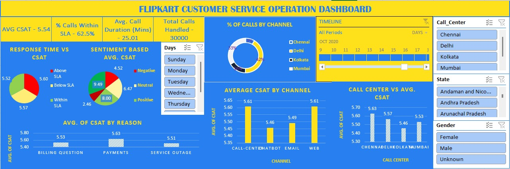

# Flipkart Customer Service Operation Dashboard

## Project Overview
An Excel-based interactive dashboard analyzing 30,000+ customer service records to identify key factors affecting customer satisfaction (CSAT) and customer retention at Flipkart.

This project follows a structured data analytics workflow including data cleaning, exploratory analysis, and dashboard development to generate actionable business insights.

---

## Business Problem
Flipkart has observed a decline in customer retention. Since customer service plays a critical role in user experience, this project aims to analyze service operations and identify factors impacting customer satisfaction and retention.

---

## Dataset Details
- Total Records: 30,000+
- Data Source: Customer call data
- Key Features:
  - Customer ID & Name
  - Gender
  - Sentiment (Very Positive to Very Negative)
  - CSAT Score
  - Call Timestamp
  - Call Reason (Billing, Payments, Service Outage)
  - City & State
  - Channel (Call Center, Chatbot, Email, Web)
  - Response Time (SLA-based)
  - Call Duration

---

## Analytical Approach

### Hypotheses
- Reducing response time improves customer satisfaction (CSAT)
- Negative sentiment leads to lower CSAT scores
- Customer satisfaction varies across call centers
- Service channels impact customer experience differently

---

##  Data Cleaning & Transformation (CLEANED DATA)
- Removed duplicate records
- Handled missing values
- Standardized categorical variables
- Extracted **Day** from timestamp for trend analysis
- Structured dataset for pivot-based analysis

---

## Exploratory Data Analysis (PIVOT TABLE)

### Key Analysis Performed:
- Average CSAT by Call Center
- CSAT vs Response Time (Within SLA, Below SLA, Above SLA)
- CSAT by Channel (Call Center, Chatbot, Email, Web)
- Sentiment vs CSAT relationship
- Call volume distribution across centers
- CSAT by Issue Type (Billing, Payments, Service Outage)

---

## Dashboard (DASHBOARD)

###  Key KPIs:
- Average CSAT: **5.54**
- Total Calls Handled: **30,000**
- Average Call Duration: **25.01 minutes**
- Calls Within SLA: **62.5%**

###  Features:
- Interactive slicers:
  - Gender
  - State
  - Call Center
  - Day
- Timeline filter for date-based analysis
- Dynamic visualizations:
  - Response Time vs CSAT
  - Sentiment-based CSAT
  - Average CSAT by Channel
  - Call Center Performance
  - Percentage of Calls by Channel
  - CSAT by Reason

---

##  Key Insights
- Faster response time leads to higher customer satisfaction  
- Very Negative sentiment results in significantly low CSAT (~2.46)  
- Chatbot channel has lower satisfaction compared to Call Center and Web  
- Kolkata call center shows relatively lower CSAT performance  
- Service outages negatively impact customer experience  

---

##  Recommendations
- Improve SLA adherence to reduce response delays  
- Train customer service agents to handle negative sentiment effectively  
- Enhance chatbot performance or enable faster escalation  
- Standardize best practices across high-performing call centers  
- Prioritize faster resolution of service outage issues  

---

##  Tools & Skills Used
- Microsoft Excel  
- Data Cleaning  
- Pivot Tables  
- Dashboard Design  
- Data Visualization  
- Business Analysis  

---

##  Project Structure

- RAW DATA - Original dataset  
- CLEANED DATA - Processed dataset  
- PIVOT TABLE - Aggregated analysis  
- DASHBOARD - Interactive dashboard  

---

##  Dashboard Preview

---

##  Files in Repository
- flipkart_customer_service_dashboard.xlsx
- README.md

---
##  Note
This project was completed as part of a Business Analyst Fellowship program.

---
##  Author
Charu Dharshana R
##  Contact
- LinkedIn: linkedin.com/in/charudharshana
